# System Architecture Visualizations

This document contains comprehensive system architecture diagrams for the WebMail Laravel project.

## 1. Complete System Architecture Overview

## 2. System Features and Capabilities

```mermaid
graph TD
    subgraph "📊 Key Features & Capabilities"
        subgraph "🚀 Campaign Management"
            CM1[Multi-Sender Campaigns]
            CM2[Content Variations]
            CM3[Template Variables]
            CM4[Recipient File Upload]
            CM5[Campaign Scheduling]
            CM6[Real-time Monitoring]
            CM7[Suppression Lists]
        end

        subgraph "📈 Analytics & Tracking"
            AT1[Open/Click Tracking]
            AT2[Bounce Monitoring]
            AT3[Sender Performance]
            AT4[Domain Analytics]
            AT5[Geographic Insights]
            AT6[Real-time Statistics]
        end

        subgraph "🔐 Admin Features"
            AF1[User Management]
            AF2[System Monitoring]
            AF3[Queue Management]
            AF4[Backup System]
            AF5[Domain Verification]
            AF6[Global Settings]
            AF7[Notification Management]
        end

        subgraph "🔔 Notification System"
            NS1[Multi-Channel Delivery]
            NS2[Campaign Milestones]
            NS3[Failure Alerts]
            NS4[Performance Warnings]
            NS5[Admin Notifications]
            NS6[Real-time Updates]
        end

        subgraph "🛠️ Technical Features"
            TF1[Queue-based Processing]
            TF2[File Management]
            TF3[Cache Optimization]
            TF4[Error Handling]
            TF5[Security Measures]
            TF6[API Rate Limiting]
            TF7[Automated Backups]
        end
    end

    subgraph "🔄 Data Flow"
        DF1[User Creates Campaign] --> DF2[File Upload & Processing]
        DF2 --> DF3[Validation & Storage]
        DF3 --> DF4[Queue Job Dispatch]
        DF4 --> DF5[Email Processing]
        DF5 --> DF6[Tracking & Analytics]
        DF6 --> DF7[Real-time Updates]
        DF7 --> DF8[Notifications]
    end

    subgraph "🗂️ System Architecture Layers"
        L1[Presentation Layer - React Frontend]
        L2[API Layer - Laravel Controllers]
        L3[Business Logic - Services]
        L4[Queue Processing - Jobs]
        L5[Data Layer - Models & Database]
        L6[Infrastructure - External Services]
        
        L1 --> L2
        L2 --> L3
        L3 --> L4
        L4 --> L5
        L3 --> L6
    end

    style CM1 fill:#e3f2fd
    style AT1 fill:#e8f5e8
    style AF1 fill:#fff3e0
    style NS1 fill:#f3e5f5
    style TF1 fill:#fce4ec
    style DF1 fill:#e0f2f1
    style L1 fill:#f1f8e9
```

## 3. Campaign Lifecycle Sequence

## 4. Campaign Notification System

```mermaid
graph TD
    A[Campaign Events] --> B[Notification Types]
    
    A --> A1[Campaign Created]
    A --> A2[Campaign Started]
    A --> A3[Campaign Progress]
    A --> A4[Campaign Completed]
    A --> A5[Campaign Failed]
    A --> A6[High Bounce Rate]
    
    A1 --> B1[CampaignCreated Notification]
    A2 --> B2[CampaignStatusChanged Notification]
    A3 --> B3[CampaignMilestone Notification]
    A4 --> B4[CampaignCompleted Notification]
    A5 --> B5[CampaignFailed Notification]
    A6 --> B6[HighBounceRateAlert Notification]
    
    B1 --> C[Delivery Channels]
    B2 --> C
    B3 --> C
    B4 --> C
    B5 --> C
    B6 --> C
    
    C --> C1[📧 Email]
    C --> C2[💾 Database]
    C --> C3[📡 Real-time Broadcast]
    C --> C4[📱 Telegram]
    
    D[Frontend Display] --> D1[📊 Dashboard Notifications]
    D[Frontend Display] --> D2[🔔 Real-time Updates]
    D[Frontend Display] --> D3[📋 Notification Center]
    
    C2 --> D1
    C3 --> D2
    C2 --> D3
    
    E[Milestones] --> E1[25% Complete]
    E[Milestones] --> E2[50% Complete]
    E[Milestones] --> E3[75% Complete]
    E[Milestones] --> E4[90% Complete]
    
    F[Alert Thresholds] --> F1[Bounce Rate > 10%]
    
    style B1 fill:#e3f2fd
    style B2 fill:#e3f2fd
    style B3 fill:#f3e5f5
    style B4 fill:#e8f5e8
    style B5 fill:#ffebee
    style B6 fill:#fff3e0
```

## System Strengths

### ✅ **Scalable Architecture**
- Queue-based processing handles large campaigns
- Microservice-style separation of concerns
- Horizontal scaling capabilities

### ✅ **Real-time Features**
- WebSocket integration for live monitoring
- Instant notifications across multiple channels
- Live dashboard updates

### ✅ **Comprehensive Monitoring**
- Multi-channel notification system
- Detailed analytics and performance insights
- Proactive bounce rate monitoring

### ✅ **Admin Control**
- Complete system management capabilities
- User management and access control
- System-wide configuration management

### ✅ **Security & Reliability**
- Proper authentication and authorization
- Backup systems and data protection
- Input validation and suppression lists

### ✅ **Production Ready**
- Error handling and logging
- Queue management and monitoring
- Performance optimization with caching

---

*These visualizations represent the current state of the WebMail Laravel system as of the latest updates.*
