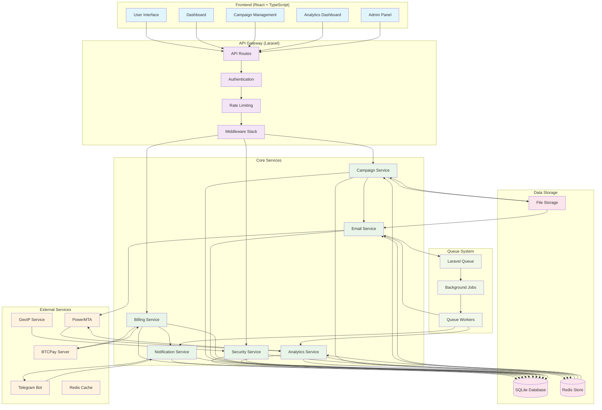
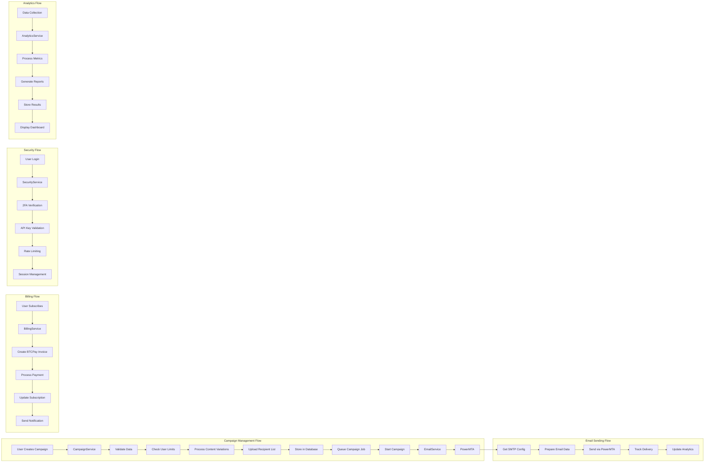
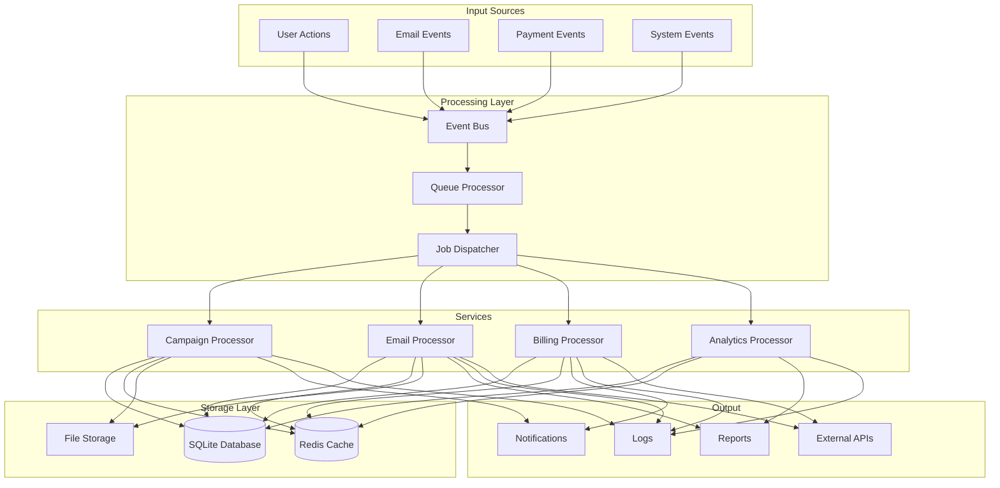
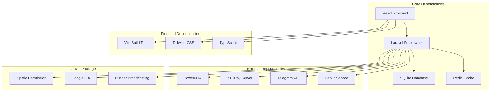
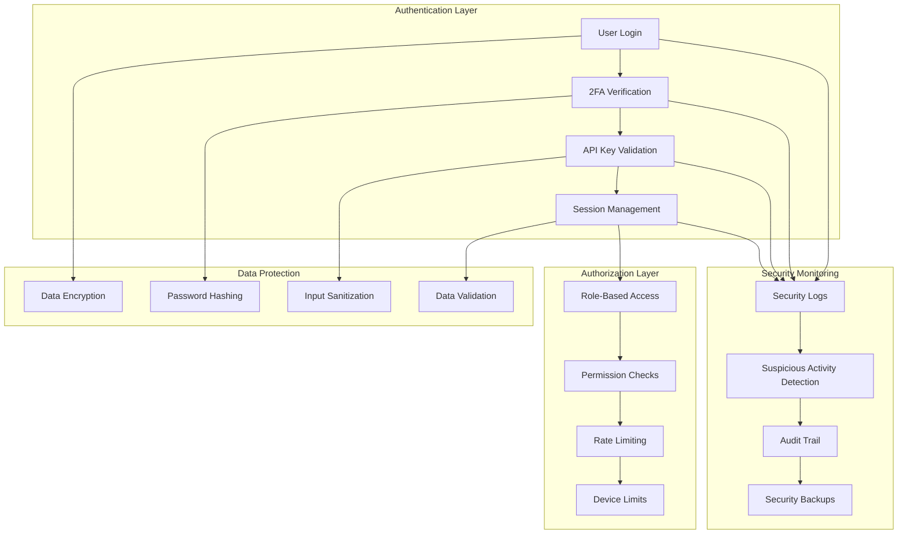
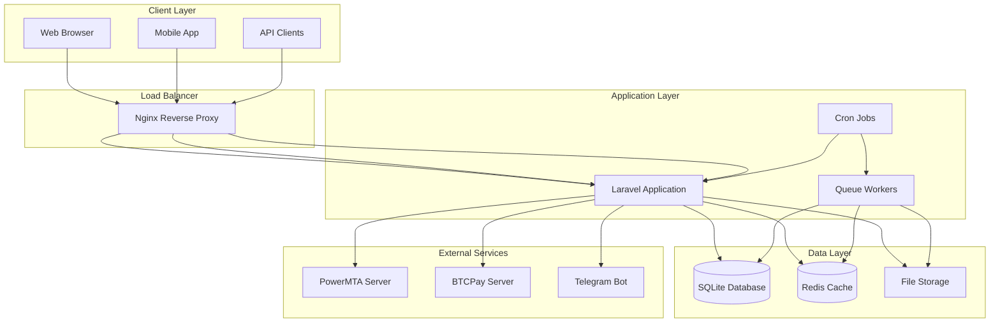

# Email Campaign Management System - Architecture Flowchart

## Detailed Service Architecture

## Data Flow Architecture

## Component Dependencies

## Security Architecture

## Deployment Architecture

