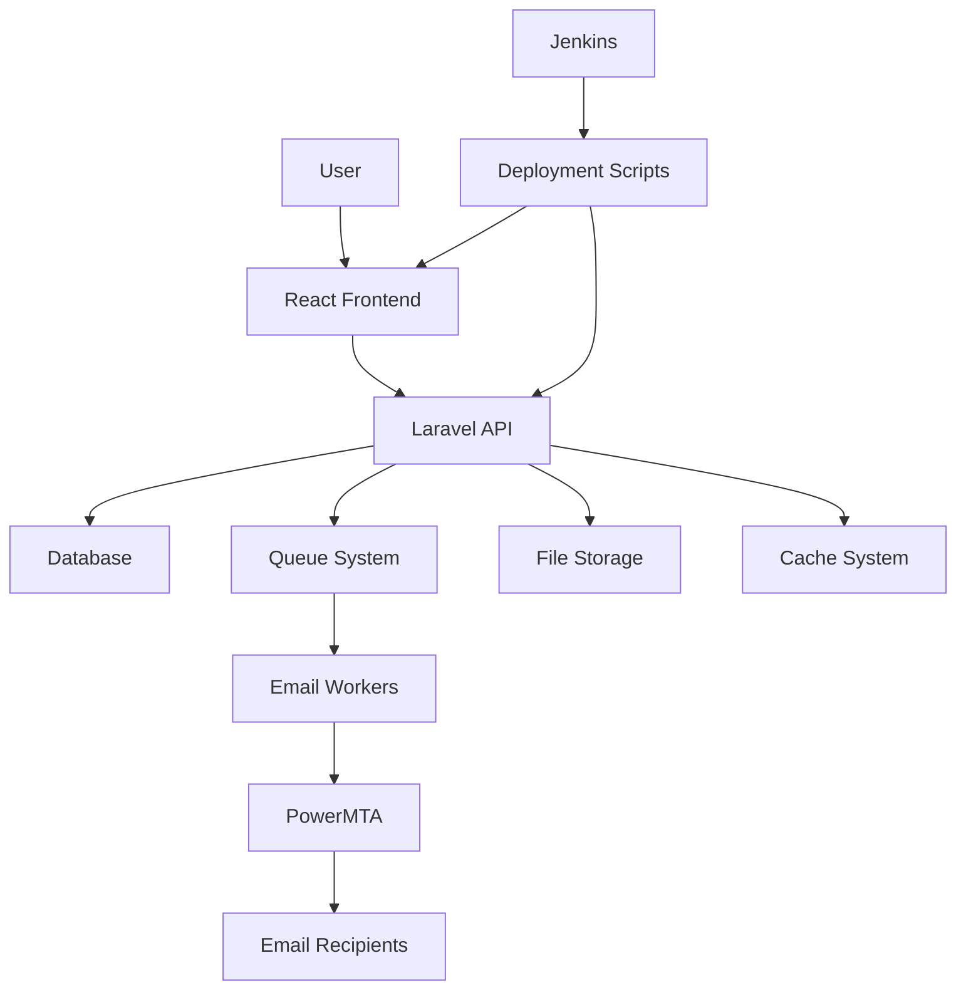

# Campaign Pro X - Complete Project Documentation

## Table of Contents

1. [Project Overview](#project-overview)
2. [Project Structure](#project-structure)
3. [Setup and Installation](#setup-and-installation)
4. [Deployment System](#deployment-system)
5. [Queue Management](#queue-management)
6. [Backup and Restore](#backup-and-restore)
7. [Configuration Fixes](#configuration-fixes)
8. [System Architecture](#system-architecture)
9. [Code Refactoring History](#code-refactoring-history)
10. [Troubleshooting](#troubleshooting)

---

## Project Overview

Campaign Pro X is a comprehensive email campaign management system built with Laravel (backend) and React (frontend). The system provides professional email marketing capabilities with campaign creation, contact management, tracking, and analytics.

### Key Features
- Email campaign creation and management
- Contact list management and segmentation
- Real-time tracking and analytics
- Template system with variables
- Unsubscribe management
- Queue-based email processing
- Professional dashboard interface

### Technology Stack
- **Backend**: Laravel 10+ with PHP 8.3
- **Frontend**: React with Vite build system
- **Database**: SQLite (production) / MySQL (optional)
- **Queue System**: Database-based with Supervisor
- **Email Processing**: Laravel Mail with PowerMTA integration
- **Deployment**: Jenkins CI/CD pipeline

---

## Project Structure

### Root Directory Structure

```text
webmailaravel.lcl/
├── .git/                 # Git repository data
├── .gitignore           # Git ignore rules
├── README.md            # Project overview and setup
├── CHANGELOG.md         # Version history and changes
├── Dockerfile           # Docker configuration
├── Jenkinsfile          # CI/CD pipeline configuration
├── backend/             # Laravel API application
├── frontend/            # React web application
├── deployment/          # Production deployment files
├── scripts/             # Utility and maintenance scripts
├── tests/               # Integration and system tests
└── docs/                # Project documentation
```

### Backend Structure (Laravel)

```text
backend/
├── app/                 # Application source code
│   ├── Http/            # Controllers and middleware
│   ├── Models/          # Eloquent models
│   ├── Services/        # Business logic services
│   ├── Jobs/            # Queue jobs
│   ├── Mail/            # Mail classes
│   ├── Notifications/   # Notification classes
│   └── Traits/          # Reusable traits
├── bootstrap/           # Framework bootstrap files
├── config/              # Configuration files
├── database/            # Database migrations and seeders
├── public/              # Web server document root
├── resources/           # Views, assets, and language files
├── routes/              # Route definitions
├── storage/             # Generated files and logs
├── tests/               # Unit and feature tests
├── vendor/              # Composer dependencies
├── composer.json        # PHP dependencies
├── artisan              # Command-line interface
└── .env                 # Environment configuration
```

### Frontend Structure (React)

```text
frontend/
├── public/              # Static public assets
├── src/                 # React source code
│   ├── components/      # Reusable components
│   ├── pages/           # Page components
│   ├── services/        # API services
│   ├── store/           # Redux store
│   └── utils/           # Utility functions
├── package.json         # Node.js dependencies
└── vite.config.js       # Build configuration
```

---

## Setup and Installation

### Prerequisites

1. **Domain Configuration**
   - Primary domain: `campaignprox.msz-pl.com` (frontend)
   - Subdomain: `api.msz-pl.com` (backend API)

2. **User Setup**
   ```bash
   # Create application user
   sudo useradd -m -s /bin/bash campaignprox
   sudo passwd campaignprox  # Set password: Koolup@1992
   ```

3. **Directory Structure**
   ```bash
   # Create required directories
   sudo mkdir -p /home/campaignprox/public_html
   sudo mkdir -p /home/campaignprox/domains/api.msz-pl.com/public_html
   sudo mkdir -p /home/campaignprox/domains/api.msz-pl.com/public_html/backups
   sudo mkdir -p /home/campaignprox/logs
   
   # Set ownership
   sudo chown -R campaignprox:campaignprox /home/campaignprox/
   sudo chmod -R 755 /home/campaignprox/domains /home/campaignprox/public_html
   sudo chmod -R 775 /home/campaignprox/logs
   ```

### Server Requirements

#### PHP Installation
```bash
# Install PHP 8.3 and Extensions
sudo apt update
sudo apt install -y software-properties-common
sudo add-apt-repository ppa:ondrej/php
sudo apt update
sudo apt install -y php8.3 php8.3-fpm php8.3-cli php8.3-common php8.3-mysql \
    php8.3-zip php8.3-gd php8.3-mbstring php8.3-curl php8.3-xml php8.3-bcmath \
    php8.3-sqlite3 php8.3-intl php8.3-tokenizer php8.3-json
```

#### Node.js Installation
```bash
# Install Node.js 18+
curl -fsSL https://deb.nodesource.com/setup_18.x | sudo -E bash -
sudo apt-get install -y nodejs
```

#### Composer Installation
```bash
# Install Composer globally
curl -sS https://getcomposer.org/installer | php
sudo mv composer.phar /usr/local/bin/composer
sudo chmod +x /usr/local/bin/composer
```

#### Additional Tools
```bash
# Install deployment dependencies
sudo apt install -y rsync sshpass git
```

### Apache Configuration

#### Enable Required Modules
```bash
sudo a2enmod rewrite
sudo a2enmod ssl
sudo systemctl restart apache2
```

#### Virtual Host for Frontend (campaignprox.msz-pl.com)
Create `/etc/apache2/sites-available/campaignprox.conf`:
```apache
<VirtualHost *:80>
    ServerName campaignprox.msz-pl.com
    DocumentRoot /home/campaignprox/public_html
    
    <Directory /home/campaignprox/public_html>
        AllowOverride All
        Require all granted
    </Directory>
    
    ErrorLog /home/campaignprox/logs/frontend_error.log
    CustomLog /home/campaignprox/logs/frontend_access.log combined
</VirtualHost>
```

#### Virtual Host for Backend API (api.msz-pl.com)
Create `/etc/apache2/sites-available/api.msz-pl.com.conf`:
```apache
<VirtualHost *:80>
    ServerName api.msz-pl.com
    DocumentRoot /home/campaignprox/domains/api.msz-pl.com/public_html
    
    <Directory /home/campaignprox/domains/api.msz-pl.com/public_html>
        AllowOverride All
        Require all granted
    </Directory>
    
    ErrorLog /home/campaignprox/logs/api_error.log
    CustomLog /home/campaignprox/logs/api_access.log combined
</VirtualHost>
```

#### Enable Sites
```bash
sudo a2ensite campaignprox.conf
sudo a2ensite api.msz-pl.com.conf
sudo systemctl reload apache2
```

### SSL Configuration (Optional)
```bash
# Install Certbot
sudo apt install -y certbot python3-certbot-apache

# Generate certificates
sudo certbot --apache -d campaignprox.msz-pl.com -d api.msz-pl.com
```

---

## Deployment System

### Overview

The deployment system has been streamlined to remove Virtualmin dependencies while maintaining professional automation. The system uses Jenkins for CI/CD with comprehensive backup and restore capabilities.

### Deployment Scripts

#### Backend Deployment
- **Script**: `scripts/deploy-backend.sh`
- **Target**: `/home/campaignprox/domains/api.msz-pl.com/public_html`
- **Features**:
  - Automatic backups before deployment
  - Composer dependency installation
  - Laravel configuration caching
  - Database migrations
  - Queue worker management
  - Permission fixing
  - Automatic rollback on failure

#### Frontend Deployment
- **Script**: `scripts/deploy-frontend.sh`
- **Target**: `/home/campaignprox/public_html`
- **Features**:
  - Automatic backups before deployment
  - NPM dependency installation
  - Vite build process
  - Static file deployment
  - Automatic rollback on failure

### Environment Configuration

#### Production Environment Variables
Key variables in `backend/.env.production`:

```env
APP_NAME="Campaign Pro X"
APP_ENV=production
APP_DEBUG=false
APP_URL=https://api.msz-pl.com
APP_FRONTEND_URL=https://campaignprox.msz-pl.com
FRONTEND_URL=https://campaignprox.msz-pl.com

# Database
DB_CONNECTION=sqlite
DB_DATABASE=/home/campaignprox/domains/api.msz-pl.com/public_html/database/database.sqlite

# Queue
QUEUE_CONNECTION=database

# Mail Configuration
MAIL_MAILER=smtp
MAIL_HOST=your-smtp-host
MAIL_PORT=587
MAIL_USERNAME=your-username
MAIL_PASSWORD=your-password
```

### Jenkins Pipeline

The Jenkins pipeline automatically:
1. Pulls latest code from repository
2. Runs tests (if configured)
3. Triggers deployment scripts
4. Handles failures with automatic rollback
5. Sends notifications on completion

---

## Queue Management

### Overview

The queue system automatically adapts to the environment:

- **Development**: Uses `sync` connection (immediate processing)
- **Production**: Uses `database` connection with Supervisor workers

### Configuration

The queue connection is automatically determined:

```php
// config/queue.php
'default' => env('QUEUE_CONNECTION', env('APP_ENV') === 'production' ? 'database' : 'sync')
```

### Development Setup

No setup required - jobs execute immediately when dispatched.

### Production Setup

Run the automated setup script once:

```bash
sudo /home/users/codepad/www/webmailaravel.lcl/deployment/setup-production-queues.sh
```

This script:
- ✅ Installs Supervisor (if not present)
- ✅ Configures queue workers as system services
- ✅ Starts workers automatically
- ✅ Sets up automatic restart on crash/reboot
- ✅ Creates proper log files

### Queue Management Scripts

#### Start Queue Workers
```bash
./scripts/start-queue-worker.sh
```

#### Restart Queue Workers
```bash
./scripts/restart-queue-workers.sh
```

#### Optimize Queue Workers
```bash
./scripts/optimize-queue-workers.sh
```

#### Monitor Campaign Status
```bash
./scripts/monitor_campaign_status.php
```

### Supervisor Configuration

Configuration file: `/etc/supervisor/conf.d/laravel-worker.conf`

```ini
[program:laravel-worker]
process_name=%(program_name)s_%(process_num)02d
command=php /home/campaignprox/domains/api.msz-pl.com/public_html/artisan queue:work database --sleep=3 --tries=3 --max-time=3600
autostart=true
autorestart=true
stopasgroup=true
killasgroup=true
user=campaignprox
numprocs=3
redirect_stderr=true
stdout_logfile=/home/campaignprox/logs/worker.log
stopwaitsecs=3600
```

---

## Backup and Restore

### Overview

Comprehensive backup and restore functionality ensures system reliability and quick recovery from deployment failures.

### Backup Strategy

#### Backend Backups
- **Location**: `/home/campaignprox/domains/api.msz-pl.com/public_html/backups/`
- **Files backed up**:
  - Complete backend directory as `backend_backup_YYYYMMDD_HHMMSS.tar.gz`
  - Database as `database_backup_YYYYMMDD_HHMMSS.sqlite`
  - Backup state tracking in `.last_backup` file
- **Retention**: Last 5 backups are kept automatically

#### Frontend Backups
- **Location**: `/home/campaignprox/backups/`
- **Files backed up**:
  - Complete frontend directory as `frontend_backup_YYYYMMDD_HHMMSS.tar.gz`
  - Backup state tracking in `.last_frontend_backup` file
- **Retention**: Last 5 backups are kept automatically

### Automatic Restore on Failure

Both deployment scripts automatically:
1. **Create backup** before starting deployment
2. **Deploy new files** using temporary locations
3. **Validate deployment** with comprehensive checks
4. **Auto-restore on failure** if any step fails
5. **Clean up** temporary files on success

### Manual Rollback

Use the enhanced `rollback.sh` script:

#### List Available Backups
```bash
./rollback.sh --list
```

#### Rollback Both Frontend and Backend (Latest)
```bash
./rollback.sh
```

#### Rollback Specific Component
```bash
./rollback.sh --component backend
./rollback.sh --component frontend
```

#### Rollback to Specific Timestamp
```bash
./rollback.sh --component backend --timestamp 20250811_143022
./rollback.sh --component both --timestamp 20250811_143022
```

### Safety Features

1. **Pre-rollback backups**: Current state is backed up before any rollback
2. **Validation checks**: Critical files are verified before considering deployment successful
3. **Service management**: Web services are properly stopped/started during operations
4. **Permission fixing**: Ownership and permissions are restored correctly
5. **Database integrity**: Database backups are handled separately for safety

---

## Configuration Fixes

### CORS Configuration Fix

#### Issue
CORS errors in production where the frontend (`https://campaignprox.msz-pl.com`) cannot access the backend API (`https://api.msz-pl.com`) due to incorrect `Access-Control-Allow-Origin` headers.

#### Root Cause
The production server was using development environment settings where `CORS_ALLOWED_ORIGINS` was set to `http://localhost:3000` instead of the production frontend URL.

#### Solution
1. **Updated CORS configuration** in `backend/config/cors.php` to be environment-aware:

```php
'allowed_origins' => explode(',', env('CORS_ALLOWED_ORIGINS', 
    env('APP_ENV') === 'production' 
        ? 'https://campaignprox.msz-pl.com' 
        : 'http://localhost:3000'
)),
```

2. **Added CORS environment variable** to production configuration:

```env
# In .env.production
CORS_ALLOWED_ORIGINS=https://campaignprox.msz-pl.com
```

3. **Created production CORS fix script** (`scripts/fix-production-cors.sh`) to:
   - Backup current environment file
   - Copy `.env.production` to `.env`
   - Clear and rebuild Laravel caches
   - Verify configuration settings

#### Manual Fix Steps
If CORS errors occur in production, run the fix script:

```bash
cd /home/campaignprox/domains/api.msz-pl.com/public_html
/path/to/scripts/fix-production-cors.sh
```

Or manually:

```bash
# Copy production environment
cp .env.production .env

# Clear Laravel caches
php artisan config:clear
php artisan config:cache
php artisan route:cache
php artisan view:cache

# Restart web server (if needed)
sudo systemctl reload apache2
```

### Unsubscribe Link Configuration

#### Issue
Unsubscribe links were incorrectly pointing to the backend API URL instead of the frontend URL.

#### Solution
Fixed the `APP_FRONTEND_URL` environment variable in production:

```env
# Before (incorrect)
APP_FRONTEND_URL=https://campaignprox.msz.pl.com

# After (correct)
APP_FRONTEND_URL=https://campaignprox.msz-pl.com
```

#### Code Location
Unsubscribe link generation in `backend/app/Models/Campaign.php`:

```php
public function getUnsubscribeLink(string $email): string
{
    if (!$this->enable_unsubscribe_link) {
        return '';
    }

    // Generate a unique unsubscribe token
    $token = hash('sha256', $email . $this->id . config('app.key'));
    
    // Return frontend URL instead of direct API call for better UX
    $frontendUrl = config('app.frontend_url', config('app.url'));
    return $frontendUrl . '/unsubscribe/' . $token;
}
```

### JWT Configuration

The JWT authentication system has been properly configured for production use with:
- Secure token generation
- Proper expiration times
- Refresh token support
- CORS configuration for frontend-backend communication

### PowerMTA Integration

PowerMTA setup for high-volume email sending:

#### Configuration
```bash
# PowerMTA service configuration
sudo systemctl enable powermta
sudo systemctl start powermta
```

#### Laravel Integration
Mail configuration in `config/mail.php`:

```php
'powermta' => [
    'transport' => 'smtp',
    'host' => 'localhost',
    'port' => 25,
    'encryption' => null,
    'username' => null,
    'password' => null,
]
```

### Cloudflare IP Fix

For applications behind Cloudflare, proper IP detection is configured:

#### Trusted Proxies
In `app/Http/Middleware/TrustProxies.php`:

```php
protected $proxies = [
    '173.245.48.0/20',
    '103.21.244.0/22',
    '103.22.200.0/22',
    // ... other Cloudflare IP ranges
];
```

---

## System Architecture

### Application Flow



### Database Schema

#### Core Tables
- **users**: User accounts and authentication
- **campaigns**: Campaign definitions and settings
- **contacts**: Contact lists and segmentation
- **campaign_contacts**: Many-to-many relationship
- **campaign_stats**: Tracking and analytics data
- **email_templates**: Reusable email templates
- **jobs**: Queue job management
- **user_activities**: Activity logging

#### Tracking System
- **email_opens**: Open tracking data
- **email_clicks**: Click tracking data
- **email_bounces**: Bounce handling
- **unsubscribes**: Unsubscribe management

### Security Features

1. **JWT Authentication**: Secure API authentication
2. **CSRF Protection**: Cross-site request forgery protection
3. **Rate Limiting**: API rate limiting to prevent abuse
4. **Input Validation**: Comprehensive input validation
5. **SQL Injection Prevention**: Eloquent ORM protection
6. **XSS Protection**: Output escaping and sanitization

---

## Code Refactoring History

### Controller Refactoring

The application has undergone significant refactoring to improve code organization and maintainability:

#### Base Controller Enhancement
- Standardized error handling across all controllers
- Consistent API response formatting
- Centralized validation logic
- Improved exception handling

#### Service Layer Implementation
- Business logic extracted from controllers
- Reusable service classes for core functionality
- Better separation of concerns
- Improved testability

### Services and Traits Analysis

#### Service Classes
1. **CampaignService**: Campaign creation, management, and processing
2. **ContactService**: Contact list management and segmentation
3. **EmailService**: Email composition and sending logic
4. **TrackingService**: Analytics and tracking functionality
5. **UnifiedEmailSendingService**: Consolidated email sending

#### Trait Implementation
1. **ActivityLoggingTrait**: User activity tracking
2. **SuppressionListTrait**: Unsubscribe and bounce handling
3. **ValidationTrait**: Common validation rules
4. **ResponseTrait**: Standardized API responses

### Redundancy Elimination

#### Identified Redundancies
- Duplicate validation logic across controllers
- Repeated database query patterns
- Similar error handling code
- Redundant helper methods

#### Solutions Implemented
- Consolidated common functionality into traits
- Created reusable service methods
- Standardized response formatting
- Eliminated duplicate code paths

### Tracking and Suppression Refactoring

#### Improvements Made
1. **Unified tracking system**: Consolidated open and click tracking
2. **Enhanced suppression handling**: Better bounce and unsubscribe management
3. **Improved performance**: Optimized database queries
4. **Better error handling**: More robust error recovery

---

## Troubleshooting

### Common Issues

#### Queue Workers Not Processing
**Symptoms**: Jobs stuck in queue, campaigns not sending
**Solution**:
```bash
# Check worker status
sudo supervisorctl status laravel-worker:*

# Restart workers
./scripts/restart-queue-workers.sh

# Check logs
tail -f /home/campaignprox/logs/worker.log
```

#### Deployment Failures
**Symptoms**: Deployment script errors, services not starting
**Solution**:
```bash
# Check deployment logs
tail -f /home/campaignprox/logs/deployment.log

# Manual rollback
./rollback.sh

# Verify permissions
ls -la /home/campaignprox/domains/api.msz-pl.com/public_html
```

#### Email Sending Issues
**Symptoms**: Emails not being sent, SMTP errors
**Solution**:
```bash
# Test email configuration
php artisan tinker
>>> Mail::raw('Test email', function($message) { $message->to('test@example.com')->subject('Test'); });

# Check PowerMTA status
sudo systemctl status powermta

# Verify SMTP settings in .env
```

#### Frontend Build Errors
**Symptoms**: Vite build failures, missing dependencies
**Solution**:
```bash
cd frontend
npm install
npm run build

# Clear npm cache if needed
npm cache clean --force
```

### Health Check Scripts

#### Backend Health Check
```bash
./scripts/health-check.sh
```

#### Campaign Status Monitoring
```bash
./scripts/monitor_campaign_status.php
```

#### Queue Worker Optimization
```bash
./scripts/optimize-queue-workers.sh
```

### Log File Locations

#### Application Logs
- Laravel logs: `/home/campaignprox/domains/api.msz-pl.com/public_html/storage/logs/`
- Queue worker logs: `/home/campaignprox/logs/worker.log`
- Deployment logs: `/home/campaignprox/logs/deployment.log`

#### Server Logs
- Apache frontend: `/home/campaignprox/logs/frontend_error.log`
- Apache backend: `/home/campaignprox/logs/api_error.log`
- System logs: `/var/log/syslog`

### Performance Optimization

#### Database Optimization
```bash
# Optimize database
php artisan db:optimize

# Clear old queue jobs
php artisan queue:prune-batches --hours=48
```

#### Cache Management
```bash
# Clear application cache
php artisan cache:clear
php artisan config:cache
php artisan route:cache
php artisan view:cache
```

#### Queue Optimization
```bash
# Restart queue workers for fresh memory
./scripts/restart-queue-workers.sh

# Monitor queue performance
php artisan queue:monitor
```

---

## Maintenance

### Regular Maintenance Tasks

#### Daily
- Monitor queue worker status
- Check error logs for issues
- Verify email sending rates

#### Weekly
- Clean up old log files
- Check disk space usage
- Review campaign performance metrics

#### Monthly
- Update system packages
- Review and clean old backups
- Performance optimization review

### Backup Verification

#### Test Restore Process
```bash
# Test backend restore
./rollback.sh --component backend --dry-run

# Test frontend restore
./rollback.sh --component frontend --dry-run
```

#### Backup Integrity Check
```bash
# Verify backup archives
cd /home/campaignprox/domains/api.msz-pl.com/public_html/backups
for backup in *.tar.gz; do
    echo "Checking $backup..."
    tar -tzf "$backup" > /dev/null && echo "OK" || echo "CORRUPTED"
done
```

---

## Development Guidelines

### Code Standards
- Follow PSR-12 coding standards for PHP
- Use ESLint configuration for JavaScript/React
- Implement comprehensive error handling
- Write descriptive commit messages
- Use meaningful variable and function names

### Testing
- Write unit tests for service classes
- Implement feature tests for API endpoints
- Test queue job processing
- Verify email sending functionality

### Documentation
- Update this documentation for significant changes
- Document new API endpoints
- Maintain changelog for releases
- Comment complex business logic

---

*This documentation is comprehensive and should be updated as the system evolves. For specific technical issues, refer to the troubleshooting section or check the application logs.*
