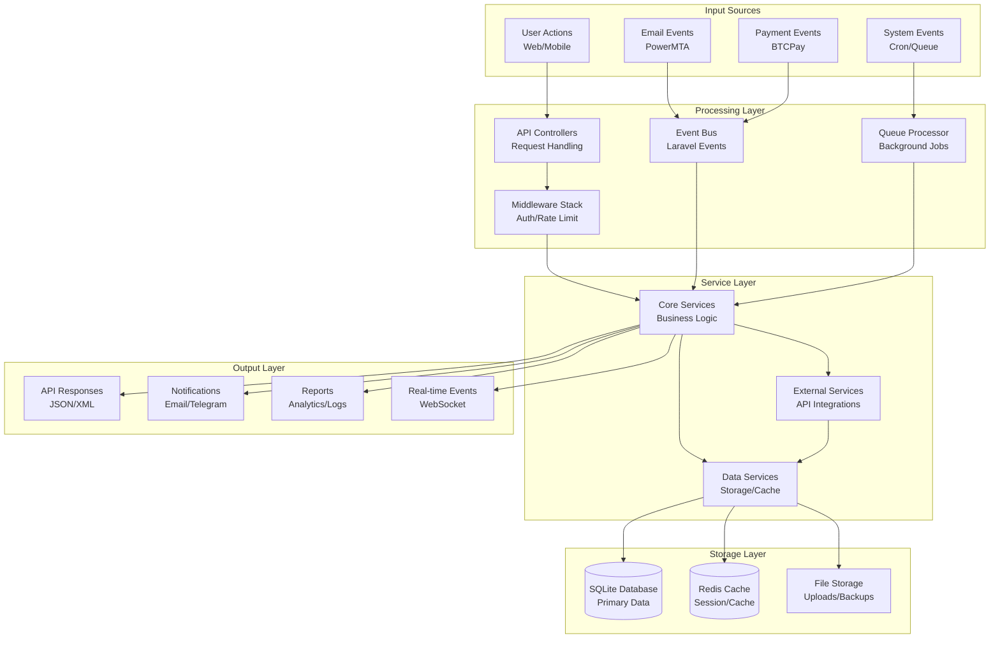
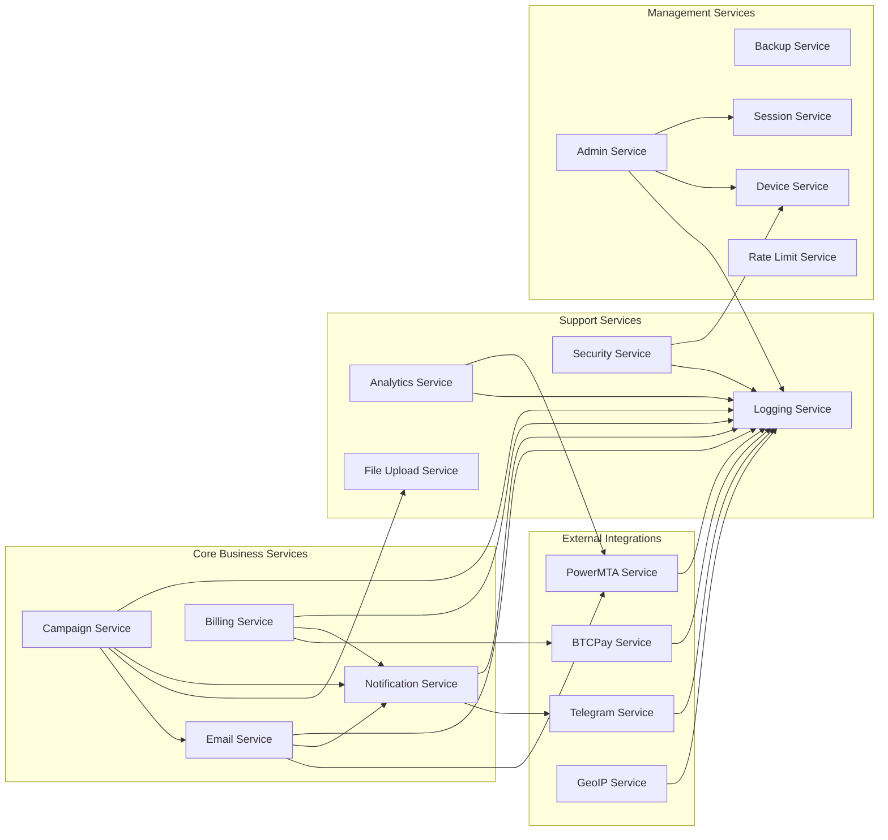
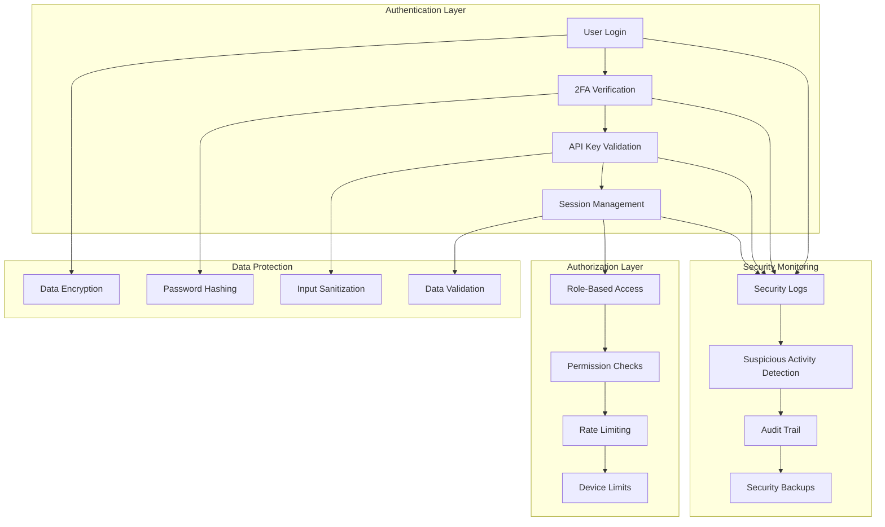
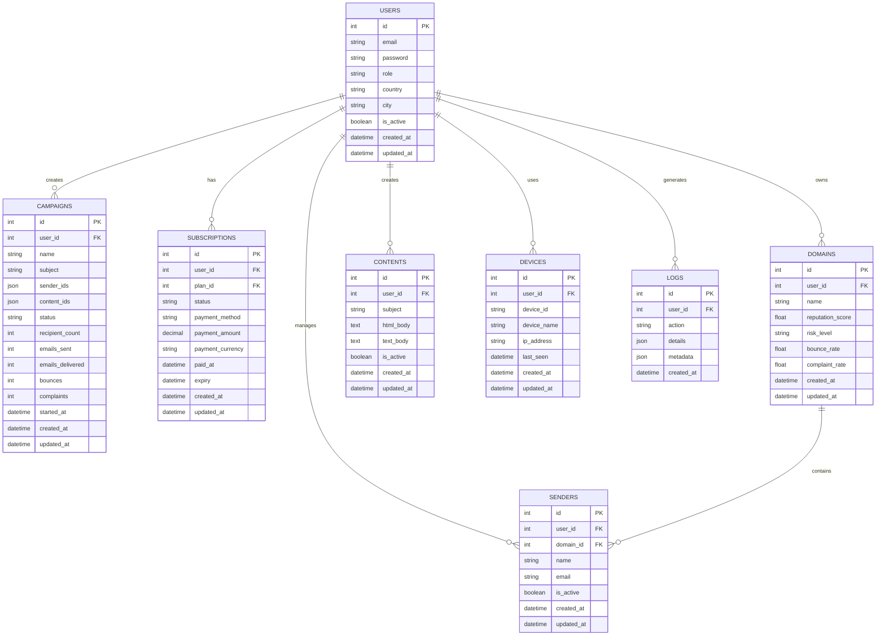
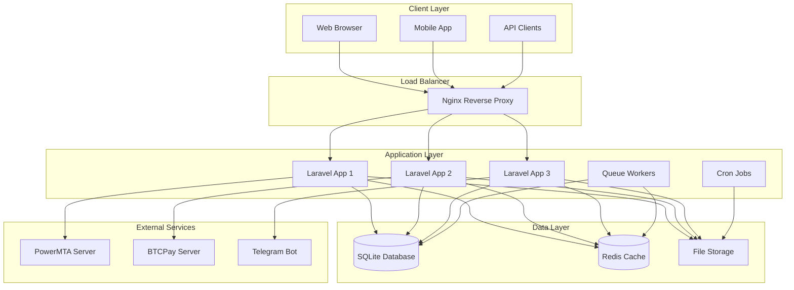
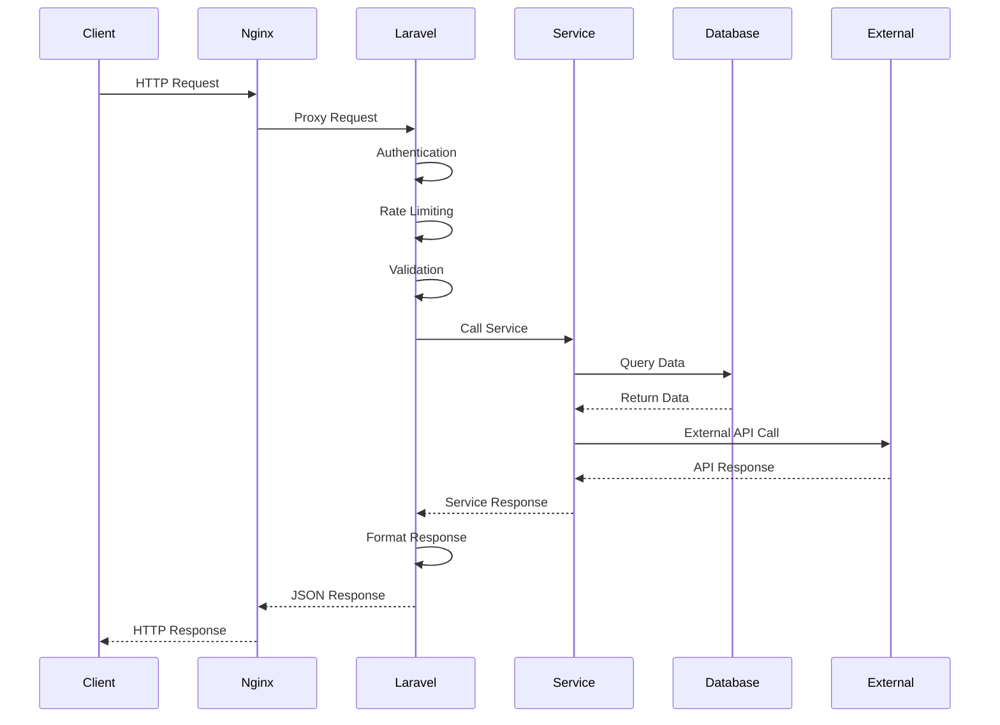
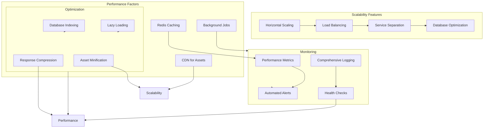
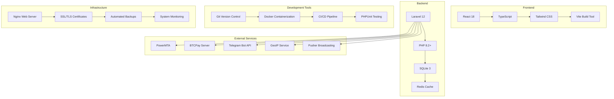

# Email Campaign Management System - Structure & Design Diagram

## 🏗️ **System Architecture Overview**

```mermaid
graph TB
    %% Client Layer
    subgraph "Client Layer"
        WebApp[Web Application<br/>React + TypeScript]
        MobileApp[Mobile App<br/>React Native]
        API[API Clients<br/>REST/GraphQL]
    end

    %% Load Balancer & Gateway
    subgraph "Gateway Layer"
        Nginx[Nginx Reverse Proxy<br/>Load Balancer]
        RateLimit[Rate Limiting<br/>Middleware]
        Auth[Authentication<br/>Middleware]
    end

    %% Application Layer
    subgraph "Application Layer"
        LaravelApp[Laravel Application<br/>API Gateway]
        QueueWorkers[Queue Workers<br/>Background Jobs]
        CronJobs[Cron Jobs<br/>Scheduled Tasks]
    end

    %% Service Layer
    subgraph "Service Layer"
        CampaignService[Campaign Service<br/>Campaign Management]
        EmailService[Email Service<br/>SMTP Integration]
        BillingService[Billing Service<br/>Payment Processing]
        NotificationService[Notification Service<br/>Multi-channel]
        SecurityService[Security Service<br/>2FA & API Keys]
        AnalyticsService[Analytics Service<br/>Business Intelligence]
        FileUploadService[File Upload Service<br/>File Processing]
        BTCPayService[BTCPay Service<br/>Cryptocurrency]
        TelegramService[Telegram Service<br/>Bot Integration]
        PowerMTAService[PowerMTA Service<br/>SMTP Reputation]
        GeoIPService[GeoIP Service<br/>Location Tracking]
        AdminService[Admin Service<br/>System Management]
        BackupService[Backup Service<br/>Data Protection]
        DeviceService[Device Service<br/>Device Management]
        SessionService[Session Service<br/>User Sessions]
        LoggingService[Logging Service<br/>Audit Trail]
        RateLimitService[Rate Limit Service<br/>Throttling]
    end

    %% Data Layer
    subgraph "Data Layer"
        SQLiteDB[(SQLite Database<br/>Primary Storage)]
        RedisCache[(Redis Cache<br/>Session & Cache)]
        FileStorage[File Storage<br/>Uploads & Backups]
    end

    %% External Services
    subgraph "External Services"
        PowerMTA[PowerMTA Server<br/>SMTP Engine]
        BTCPayServer[BTCPay Server<br/>Payment Gateway]
        TelegramBot[Telegram Bot<br/>Notifications]
        GeoIPAPI[GeoIP API<br/>Location Service]
        Pusher[Pusher<br/>Real-time Events]
    end

    %% Client to Gateway
    WebApp --> Nginx
    MobileApp --> Nginx
    API --> Nginx

    %% Gateway to Application
    Nginx --> RateLimit
    RateLimit --> Auth
    Auth --> LaravelApp

    %% Application to Services
    LaravelApp --> CampaignService
    LaravelApp --> EmailService
    LaravelApp --> BillingService
    LaravelApp --> NotificationService
    LaravelApp --> SecurityService
    LaravelApp --> AnalyticsService
    LaravelApp --> FileUploadService
    LaravelApp --> BTCPayService
    LaravelApp --> TelegramService
    LaravelApp --> PowerMTAService
    LaravelApp --> GeoIPService
    LaravelApp --> AdminService
    LaravelApp --> BackupService
    LaravelApp --> DeviceService
    LaravelApp --> SessionService
    LaravelApp --> LoggingService
    LaravelApp --> RateLimitService

    %% Services to Data
    CampaignService --> SQLiteDB
    EmailService --> SQLiteDB
    BillingService --> SQLiteDB
    NotificationService --> SQLiteDB
    SecurityService --> SQLiteDB
    AnalyticsService --> SQLiteDB
    FileUploadService --> FileStorage
    BTCPayService --> SQLiteDB
    TelegramService --> SQLiteDB
    PowerMTAService --> SQLiteDB
    GeoIPService --> SQLiteDB
    AdminService --> SQLiteDB
    BackupService --> SQLiteDB
    DeviceService --> SQLiteDB
    SessionService --> SQLiteDB
    LoggingService --> SQLiteDB
    RateLimitService --> RedisCache

    %% Services to Cache
    CampaignService --> RedisCache
    EmailService --> RedisCache
    AnalyticsService --> RedisCache
    SecurityService --> RedisCache
    SessionService --> RedisCache

    %% Services to External
    EmailService --> PowerMTA
    BillingService --> BTCPayServer
    BTCPayService --> BTCPayServer
    NotificationService --> TelegramBot
    TelegramService --> TelegramBot
    GeoIPService --> GeoIPAPI
    LaravelApp --> Pusher

    %% Background Processing
    QueueWorkers --> CampaignService
    QueueWorkers --> EmailService
    QueueWorkers --> NotificationService
    CronJobs --> BackupService
    CronJobs --> AnalyticsService
    CronJobs --> LoggingService

    %% Styling
    classDef client fill:#e3f2fd
    classDef gateway fill:#f3e5f5
    classDef application fill:#e8f5e8
    classDef service fill:#fff3e0
    classDef data fill:#fce4ec
    classDef external fill:#f1f8e9

    class WebApp,MobileApp,API client
    class Nginx,RateLimit,Auth gateway
    class LaravelApp,QueueWorkers,CronJobs application
    class CampaignService,EmailService,BillingService,NotificationService,SecurityService,AnalyticsService,FileUploadService,BTCPayService,TelegramService,PowerMTAService,GeoIPService,AdminService,BackupService,DeviceService,SessionService,LoggingService,RateLimitService service
    class SQLiteDB,RedisCache,FileStorage data
    class PowerMTA,BTCPayServer,TelegramBot,GeoIPAPI,Pusher external
```

## 🔄 **Data Flow Architecture**

## 🎯 **Service Dependencies & Relationships**

## 🔐 **Security Architecture**

## 📊 **Database Schema Overview**

## 🚀 **Deployment Architecture**

## 🔄 **Request Flow Diagram**

## 📈 **Performance & Scalability**

## 🎨 **Technology Stack**

## 📋 **System Components Summary**

### **Core Components**
- **Frontend**: React + TypeScript + Tailwind CSS
- **Backend**: Laravel 12 + PHP 8.2+ + SQLite
- **Cache**: Redis for sessions and caching
- **Queue**: Laravel Queue for background jobs
- **Real-time**: Pusher for WebSocket events

### **External Integrations**
- **Email**: PowerMTA for SMTP reputation analysis
- **Payments**: BTCPay for cryptocurrency billing
- **Notifications**: Telegram Bot for instant notifications
- **Location**: GeoIP service for user location tracking

### **Security Features**
- **Authentication**: Multi-factor authentication (2FA)
- **Authorization**: Role-based access control
- **API Security**: API key management
- **Rate Limiting**: Request throttling
- **Audit Trail**: Comprehensive logging

### **Scalability Features**
- **Horizontal Scaling**: Multiple Laravel instances
- **Load Balancing**: Nginx reverse proxy
- **Caching**: Redis for performance optimization
- **Background Processing**: Queue workers for heavy tasks
- **Database Optimization**: Indexing and query optimization

This architecture provides a robust, scalable, and secure foundation for the email campaign management system with clear separation of concerns and modern development practices. 